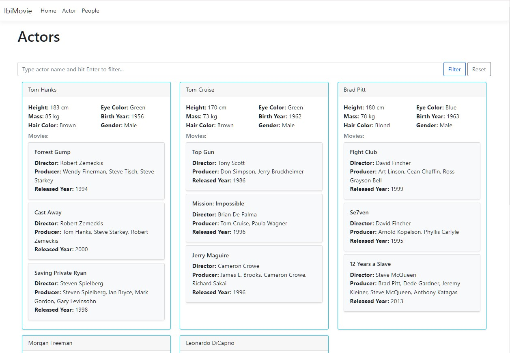
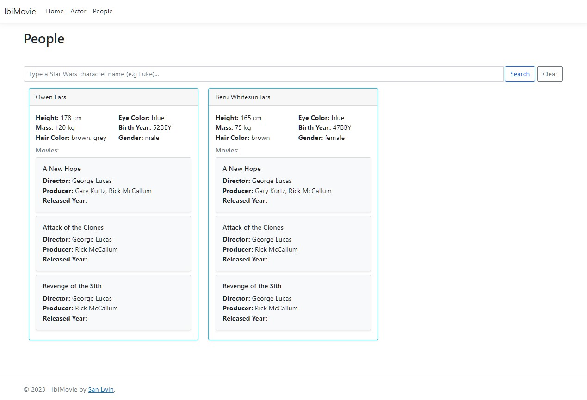

# IbiMovie

This is a simple web application with two views - Actor page showcases the association between actors and movies, allowing users to filter by actor names. People page allows users to search Star Wars character by name using SWAPI. Although PHP and Laravel are powerful technologies, I chose to use C# and ASP.NET Core MVC because of my proficiency in those languages.

Demo: [link](http://ibimoive.trimation.group)

## Project Design

Despite the simplicity of the project requirements, I decided against building a monolithic application. As a seasoned technical lead and a Clean Architecture advocate, I wanted to demonstrate my deep understanding of architectural best practices and design patterns.

The project has the following structure:

1. ibiMovie.Core project contains essential domain models, such as Actor and Movie, to encapsulate the core business logic and data structures
2. ibiMovie.Application project to describe the application-specific business rules and the actions that the system can perform
3. ibiMovie.Infra project to manage database activities.
4. ibiMovie.WebAPI project for managing API endpoints while injecting dependencies at runtime.
5. ibiMovie.WebUI project to handle user interactions and views.
6. ibiMovie.Tests project to ensure the code's correctness and reliability.

By adhering to the Clean Architecture principles and software development best practices, I have created a scalable, maintainable, and testable application that meets the project requirements and demonstrates my expertise in software architecture.

``` As a technical lead who is continuously striving to expand my skillset, I am training myself to become a polyglot technologist. I have a keen interest in exploring new programming languages and frameworks, including PHP and Laravel, to broaden my knowledge and adapt to diverse technology ecosystems.
```



